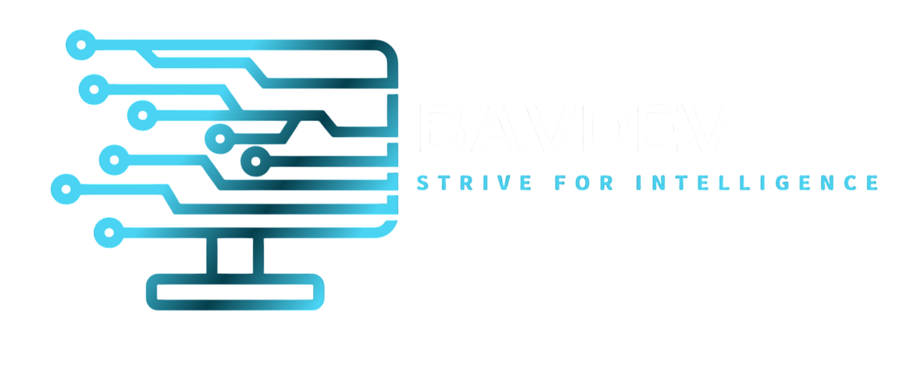

<!-- Banner / Cover Image -->
<p align="center">
  
</p>

<h1 align="center">🚀 BavDev</h1>
<p align="center">Modern. Powerful. Stunning. – The Future of Web & App Development</p>

---

## 📌 About BavDev
BavDev is a cutting-edge web and app development studio focused on building **fast, responsive, and visually stunning** digital experiences.  
We craft each project with precision, blending **design, performance, and functionality** to help you dominate the digital space.

---

## ✨ Features
- ⚡ **Ultra-Fast Performance**
- 🎨 **Sleek, Modern UI/UX**
- 📱 **Fully Responsive Designs**
- 🔒 **Secure & Reliable Code**
- 🌍 **Global Reach – Any Device, Anywhere**

---

## 🛠️ Tech Stack
| Frontend | Backend | Tools |
|----------|---------|-------|
| React.js ⚛️ | Node.js 🌐 | Git & GitHub 🐙 |
| HTML5 / CSS3 🎨 | Express.js ⚡ | VS Code 💻 |
| JavaScript (ES6+) 📜 | MongoDB 🍃 | Figma 🎯 |

---

## 📷 Preview
![BavDev Screenshot]

---

🌐 Live Link
<a href="">Visit-BavDev</a>

---

📬 Connect with Me
<p align="center"> <a href="https://github.com/YOUR-USERNAME"></a> <a href="https://twitter.com/YOUR-TWITTER"></a> <a href="https://linkedin.com/in/YOUR-LINKEDIN"></a> <a href="mailto:your@email.com"></a> </p>

---

🏆 Show Your Support
Give a ⭐ star if you like this project and want more amazing designs!

---

<p align="center">© 2025 BavDev – Built with ❤️ by Pooks</p> ```

---

## 🚀 Installation & Setup
```bash
# Clone the repository
git clone https://github.com/CarlosBavon/BavDev.git

# Navigate to the project folder
cd BavDev

# Install dependencies
npm install

# Start the development server
npm start

